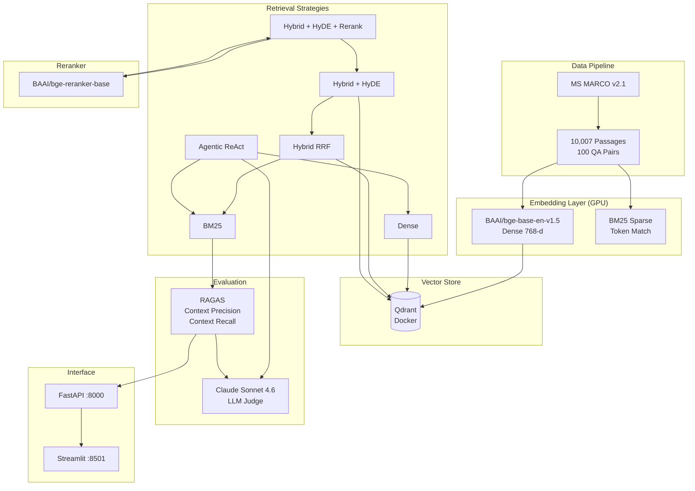

# Agentic RAG — Multi-Strategy Retrieval System

A production-grade RAG retrieval benchmark comparing 6 strategies on MS MARCO 10K, with GPU-accelerated local embeddings, Qdrant vector database, and RAGAS evaluation backed by Claude Sonnet 4.6.

## Architecture



## Quick Start

```powershell
# 1. Configure API key
notepad .env   # Set RAG_API_KEY=sk-xxx

# 2. Double-click
start.bat      # Auto-starts Docker + Qdrant + API + Streamlit

# 3. Open in browser
# http://localhost:8501  →  Streamlit UI
# http://localhost:8000/docs  →  FastAPI Swagger
```

## Pipeline

```powershell
# Run full pipeline with breakpoint resume
"D:\Qwen 2.5 7B\env\python.exe" scripts\run_all.py

# Or individual stages
"D:\Qwen 2.5 7B\env\python.exe" scripts\run_all.py --stage download_data
"D:\Qwen 2.5 7B\env\python.exe" scripts\run_all.py --stage embed
"D:\Qwen 2.5 7B\env\python.exe" scripts\run_all.py --stage index
"D:\Qwen 2.5 7B\env\python.exe" scripts\run_all.py --stage evaluate
```

## Project Structure

```
rag-project/
├── config.py                     # Global config (auto-loads .env)
├── docker-compose.yml            # Qdrant container
├── Dockerfile                    # Container build reference
├── requirements.txt              # Python dependencies
├── start.bat                     # One-click startup script
├── .env                          # API keys (gitignored)
├── README.md
├── docs/
│   └── experiment_report.docx    # Full experiment report
├── results/
│   ├── comparison.csv            # Strategy comparison CSV
│   ├── comparison.md             # Strategy comparison table
│   ├── bar_chart.png             # Bar chart
│   └── radar_chart.png           # Radar chart
├── scripts/
│   ├── run_all.py                # Pipeline orchestrator (checkpoint resume)
│   ├── download_data.py          # MS MARCO dataset loader
│   ├── embed.py                  # Dense + Sparse embeddings (GPU)
│   ├── index_qdrant.py           # Qdrant vector indexing
│   ├── retrieval.py              # 6 retrieval strategies
│   ├── evaluate.py               # RAGAS evaluation (ChatAnthropic)
│   ├── generate_results.py       # Charts + CSV generation
│   ├── generate_report.py        # Word report generation
│   ├── streamlit_app.py          # Streamlit UI entry point
│   └── app.py                    # FastAPI server + launcher
├── data/                         # passages.json + qas.json (gitignored)
├── embeddings/                   # *.npy + *.pkl (gitignored)
├── evaluation/                   # *.jsonl + summary.json (gitignored)
└── qdrant_storage/               # Qdrant persistence (gitignored)
```

## 6 Retrieval Strategies

| # | Strategy | Precision | Recall | API Calls |
|---|---|---|---|---|
| 1 | BM25 | 0.189 | 0.465 | 0 |
| 2 | Dense (BGE) | 0.301 | 0.470 | 0 |
| 3 | Hybrid RRF | 0.259 | 0.346 | 0 |
| 4 | Hybrid + HyDE | 0.160 | 0.393 | 1 |
| 5 | **Hybrid + HyDE + Rerank** | **0.379** | **0.510** | 1 |
| 6 | Agentic (ReAct) | 0.067 | 0.143 | 3-5 |

## Experiment Conclusions

1. **Hybrid + HyDE + Rerank wins** — Combining dense retrieval, hypothetical document expansion, and cross-encoder reranking achieves highest precision (0.379) and recall (0.510).
2. **RRF fusion can hurt recall** — Hybrid RRF recall (0.346) underperforms pure Dense (0.470), indicating BM25 noise degrades fusion quality on this dataset.
3. **Agentic needs refinement** — ReAct agent (0.143 recall) significantly underperforms; limited tools and weak reflection prompts are the bottlenecks.
4. **BM25 recall remains competitive** — At 0.465, BM25 nearly matches Dense (0.470), proving keyword matching still valuable as a complementary signal.

## Tech Stack

| Component | Technology | Runtime |
|---|---|---|
| Embedding | BAAI/bge-base-en-v1.5 | Local GPU (RTX 5060 Ti) |
| Reranker | BAAI/bge-reranker-base | Local GPU |
| Sparse Retrieval | BM25 (rank-bm25) | Local CPU |
| Vector DB | Qdrant v1.16 | Docker |
| Evaluation | RAGAS 0.4.x | Claude Sonnet 4.6 API |
| Backend | FastAPI | Local Python |
| Frontend | Streamlit | Local Python |

## API Endpoints

```
GET /health                  Server status
GET /strategies              List 6 strategies
GET /search?q=&strategy=&k=  Search with strategy
GET /search_all?q=&k=        Compare all strategies
GET /summary                 Evaluation scores JSON
GET /results/csv             Download CSV
GET /results/chart/{name}    Chart PNG
```

## License

MIT
