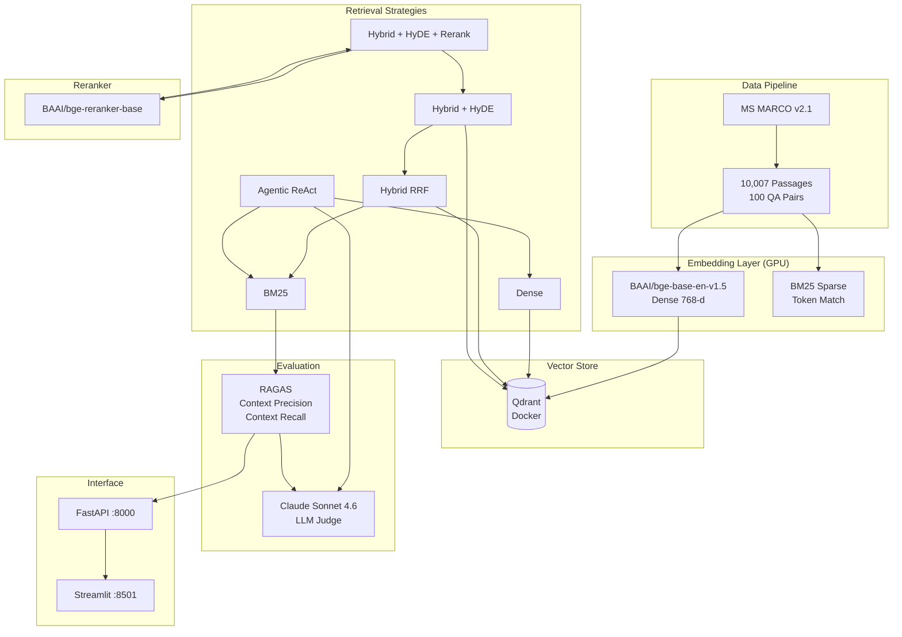

# Agentic RAG — Multi-Strategy Retrieval System

A production-grade RAG retrieval benchmark system comparing 6 strategies on MS MARCO 10K, with GPU-accelerated local embeddings, Qdrant vector database, and RAGAS evaluation backed by Claude Sonnet 4.6.

## Architecture



## Project Structure

```
rag-project/
├── config.py                  # Global configuration
├── docker-compose.yml         # One-click startup
├── Dockerfile                 # Container build
├── requirements.txt           # Python dependencies
├── .env                       # API keys (RAG_API_KEY)
├── README.md
├── scripts/
│   ├── run_all.py             # Pipeline orchestrator (checkpoint resume)
│   ├── download_data.py       # MS MARCO dataset loader
│   ├── embed.py               # Dense + Sparse embeddings (GPU)
│   ├── index_qdrant.py        # Qdrant vector indexing
│   ├── retrieval.py           # 6 retrieval strategies
│   ├── evaluate.py            # RAGAS evaluation (ChatAnthropic)
│   ├── generate_results.py    # Charts + CSV generation
│   └── app.py                 # FastAPI + Streamlit
├── data/                      # passages.json + qas.json
├── embeddings/                # dense_embeddings.npy + bm25_index.pkl
├── evaluation/                # Per-strategy jsonl + summary.json
├── results/                   # CSV + charts
├── qdrant_storage/            # Qdrant persistent data
└── pipeline_state.json        # Breakpoint resume state
```

## Setup

### Prerequisites
- Windows 11 | Python 3.11 | Docker Desktop
- NVIDIA GPU 8GB+ VRAM (RTX 5060 Ti)
- Claude API key (via [aipaibox.com](https://api.aipaibox.com))

### Quick Start

```powershell
# 1. Clone & configure
cp .env.example .env                # Edit RAG_API_KEY=sk-xxx

# 2. One-click start (Qdrant + API + UI)
docker-compose up -d

# 3. Run pipeline (or use docker-compose with GPU passthrough)
"D:\Qwen 2.5 7B\env\python.exe" scripts\run_all.py

# 4. View results
start http://localhost:8501        # Streamlit UI
start http://localhost:8000/docs   # FastAPI Swagger
```

### Pipeline Stages

| Stage | Command | Resumable |
|---|---|---|
| Download | `run_all.py --stage download_data` | Re-download |
| Embed | `run_all.py --stage embed` | Checkpoint every 500 |
| Index | `run_all.py --stage index` | Skip if indexed |
| Evaluate | `run_all.py --stage evaluate` | Per-query jsonl |

## 6 Retrieval Strategies

| # | Strategy | Description | API Calls |
|---|---|---|---|
| 1 | **BM25** | Sparse keyword matching | 0 |
| 2 | **Dense** | BGE embedding cosine similarity | 0 |
| 3 | **Hybrid RRF** | Reciprocal Rank Fusion (BM25 + Dense) | 0 |
| 4 | **Hybrid + HyDE** | RRF + Hypothetical Document Embedding | 1 per query |
| 5 | **Hybrid + HyDE + Rerank** | RRF + HyDE + BGE Reranker | 1 per query |
| 6 | **Agentic (ReAct)** | ReAct agent + Reflection loop | 3-5 per query |

## Results (MS MARCO 10K, 100 Queries)

| Strategy | Context Precision | Context Recall |
|---|---|---|
| BM25 | 0.189 | 0.465 |
| Dense (BGE) | 0.301 | 0.470 |
| Hybrid RRF | 0.259 | 0.346 |
| Hybrid + HyDE | 0.160 | 0.393 |
| **Hybrid + HyDE + Rerank** | **0.379** | **0.510** |
| Agentic (ReAct) | 0.067 | 0.143 |

### Key Findings

1. **Hybrid + HyDE + Rerank wins** — combining dense retrieval, hypothetical document expansion, and cross-encoder reranking yields the best precision (0.379) and recall (0.510).
2. **RRF alone hurts recall** — Hybrid RRF (0.346) underperforms pure Dense (0.470) on recall due to BM25 noise in fusion.
3. **Agentic needs tuning** — ReAct agent with reflection (0.143 recall) performs poorly; the retrieval tool definitions and prompt need refinement.
4. **BM25 has surprising recall** — Despite no semantic understanding, BM25 recall (0.465) nearly matches Dense (0.470) on factoid queries.

## Tech Stack

| Component | Technology | Runtime |
|---|---|---|
| Embedding | BAAI/bge-base-en-v1.5 | Local GPU (RTX 5060 Ti) |
| Reranker | BAAI/bge-reranker-base | Local GPU |
| Sparse Retrieval | BM25 (rank-bm25) | Local CPU |
| Vector DB | Qdrant v1.16 | Docker |
| Evaluation | RAGAS 0.4.x | Claude Sonnet 4.6 API |
| Backend | FastAPI | Docker |
| Frontend | Streamlit | Docker |
| Orchestration | Python 3.11 | Local/Docker |

## API Endpoints

```
GET /health              → Server status
GET /strategies          → List 6 strategies
GET /search?q=&strategy= → Search with strategy
GET /search_all?q=       → Compare all strategies
GET /summary             → Evaluation scores JSON
GET /results/csv         → Download CSV
GET /results/chart/radar_chart.png
GET /results/chart/bar_chart.png
```
